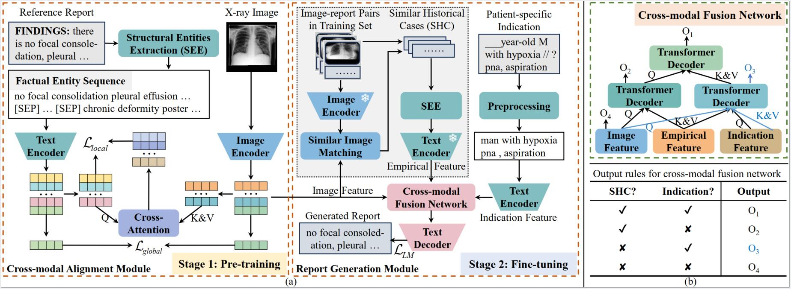
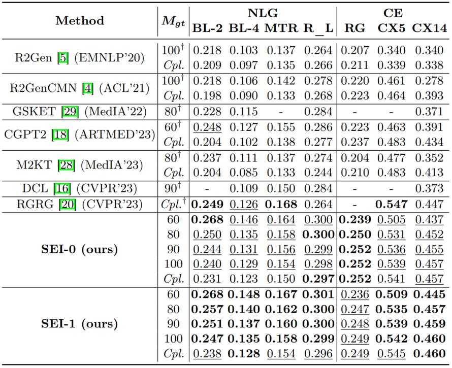
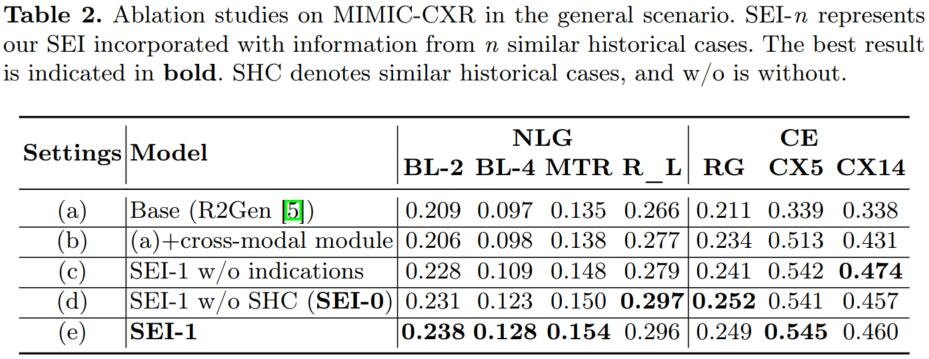
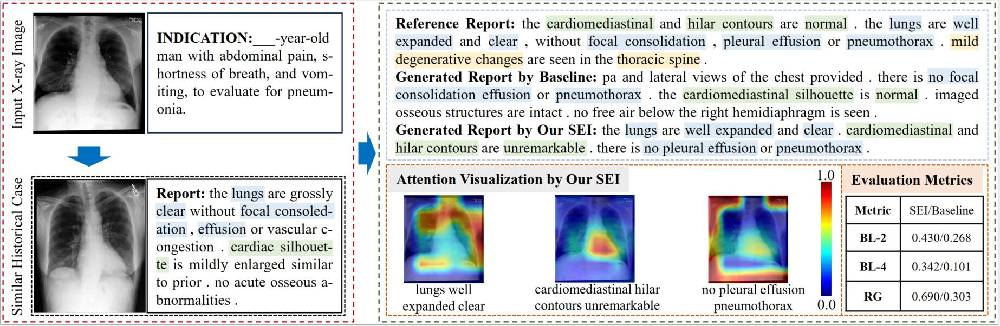
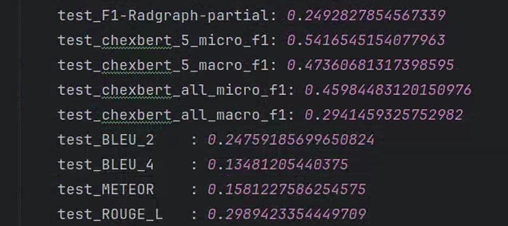

# SEI
Structural Entities Extraction and Patient Indications Incorporation for Chest X-ray Report Generation

The automated generation of imaging reports proves invaluable in alleviating the workload of radiologists. A clinically applicable reports generation algorithm should demonstrate its effectiveness in producing reports that accurately describe radiology findings and attend to patient-specific indications. In this paper, we introduce a novel method, **S**tructural **E**ntities extraction and patient indications **I**ncorporation (SEI) for chest X-ray report generation. Specifically, we employ a structural entities extraction (SEE) approach to eliminate presentation-style vocabulary in reports and improve the quality of factual entity sequences. This reduces the noise in the following cross-modal alignment module by aligning X-ray images with factual entity sequences in reports, thereby enhancing the precision of cross-modal alignment and further aiding the model in gradient-free retrieval of similar historical cases. Subsequently, we propose a cross-modal fusion network to integrate information from X-ray images, similar historical cases, and patient-specific indications. This process allows the text decoder to attend to discriminative features of X-ray images, assimilate historical diagnostic information from similar cases, and understand the examination intention of patients. This, in turn, assists in triggering the text decoder to produce high-quality reports. Experiments conducted on MIMIC-CXR validate the superiority of SEI over state-of-the-art approaches on both natural language generation and clinical efficacy metrics. 
<div align=center></div>

# Update
- **2024-09-09**, Upload the [Poster](Poster.pdf)
- **2024-09-19**, Update the repository to easily use.
- **2024-09-19**, Update the [generated reports](scripts/results/mimic_cxr/test/ft_100_top1/) for the MIMIC-CXR test set.

# Experiments
## Main Results
<div align=center></div>

## Ablation Study
<div align=center></div>
<div align=center></div>


## Citations

If you use or extend our work, please cite our paper at MICCAI 2024.

```
@InProceedings{ Liu_MICCAI2024,
      author = { Liu, Kang and Ma, Zhuoqi and Kang, Xiaolu and Zhong, Zhusi and Jiao, Zhicheng and Baird, Grayson and Bai, Harrison and Miao, Qiguang },
      title = { Structural Entities Extraction and Patient Indications Incorporation for Chest X-ray Report Generation }, 
      booktitle = {Medical Image Computing and Computer Assisted Intervention -- MICCAI 2024},
      year = {2024},
      publisher = {Springer Nature Switzerland}
      volume = { 3 }
      month = {October},
}
```

## Requirements

- `torch==2.1.2+cu118`
- `transformers==4.23.1`
- `torchvision==0.16.2+cu118`
- Due to the specific environment of RadGraph,  please refer to `knowledge_encoder/factual serialization. py` for the environment of the structural entities approach.


## Checkpoints

You can download checkpoints of SEI as follows:

- For `MIMIC-CXR`, you can download checkpoints from [Baidu Netdisk](https://pan.baidu.com/s/15SW1k3xZ57S06FUeqpclAA) (its code is `MK13`) and [huggingface 🤗](https://huggingface.co/MK-runner/SEI/tree/main).

## MIMIC-CXR Datasets

- For `MIMIC-CXR`, you can download medical images from [PhysioNet](https://physionet.org/content/mimic-cxr/2.0.0/).

- You can download `medical reports` from [Google Drive](https://drive.google.com/file/d/1iWdFINSAJ7F97I4rTGddIziJAb-1sL3l/view?usp=drive_link). Note that you can apply with your license of [PhysioNet](https://physionet.org/content/mimic-cxr-jpg/2.0.0/), and its `toy case` is in `knowledge_encoder/case.json`

## Reproducibility on MIMIC-CXR (SEI-1)

### Structural entities extraction (SEE) approach

1. Config RadGraph environment based on `knowledge_encoder/factual_serialization.py`


   ===================environmental setting=================
   
    Basic Setup (One-time activity)

   a. Clone the DYGIE++ repository from [here](https://github.com/dwadden/dygiepp). This repository is managed by Wadden et al., authors of the paper [Entity, Relation, and Event Extraction with Contextualized Span Representations](https://www.aclweb.org/anthology/D19-1585.pdf).
    ```bash
   git clone https://github.com/dwadden/dygiepp.git
    ```
    
   b. Navigate to the root of repo in your system and use the following commands to set the conda environment:
    ```bash
   conda create --name dygiepp python=3.7
   conda activate dygiepp
   cd dygiepp
   pip install -r requirements.txt
   conda develop .   # Adds DyGIE to your PYTHONPATH
   ```

   c. Activate the conda environment:
    
    ```bash
   conda activate dygiepp
    ```
   
2. Config `radgraph_path` and `ann_path` in `knowledge_encoder/see.py`. `annotation.json`, can be obtained from [here](https://drive.google.com/file/d/1DS6NYirOXQf8qYieSVMvqNwuOlgAbM_E/view?usp=sharing). Note that you can apply with your license of [PhysioNet](https://physionet.org/content/mimic-cxr-jpg/2.0.0/).

3. Run the `knowledge_encoder/see.py` to extract factual entity sequence for each report.
   
4. Finally, the `annotation.json` becomes `mimic_cxr_annotation_sen.json` that is identical to `new_ann_file_name` variable in `see.py`


### Conducting the first stage (i.e., training cross-modal alignment module)

1. Run `bash pretrain_mimic_cxr.sh` to pretrain a model on the MIMIC-CXR data (Note that the `mimic_cxr_ann_path` is `mimic_cxr_annotation_sen.json`).

### Similar historical cases retrieval for each sample

1. Config `--load` argument in `pretrain_inference_mimic_cxr.sh`. Note that the argument is the pre-trained model from the first stage.

2. Run `bash pretrain_inference_mimic_cxr.sh` to retrieve similar historical cases for each sample, forming `mimic_cxr_annotation_sen_best_reports_keywords_20.json` (i.e., the `mimic_cxr_annotation_sen.json` becomes this `*.json` file).

### Conducting the second stage (i.e., training report generation module)


1. Extract and preprocess the `indication section` in the radiology report.

   a. Config `ann_path` and `report_dir` in `knowledge_encoder/preprocessing_indication_section.py`, and its value is `mimic_cxr_annotation_sen_best_reports_keywords_20.json`. 
      Note that `report_dir` can be downloaded from [PhysioNet](https://physionet.org/content/mimic-cxr/2.0.0/).
   
   b. Run `knowledge_encoder/preprocessing_indication_section.py`, forming `mimic_cxr_annotation_sen_best_reports_keywords_20_all_components_with_fs_v0227.json`


2. Config `--load` argument in `finetune_mimic_cxr.sh`. Note that the argument is the pre-trained model from the first stage. Furthermore, `mimic_cxr_ann_path` is `mimic_cxr_annotation_sen_best_reports_keywords_20_all_components_with_fs_v0227.json`

3. Download these checkpoints. Notably, the `chexbert.pth` and `radgraph` are used to calculate CE metrics, and `bert-base-uncased` and `scibert\_scivocab\_uncased ` are pre-trained models for cross-modal fusion network and text encoder. Then put these checkpoints in the same local dir (e.g., "/home/data/checkpoints"), and configure the `--ckpt_zoo_dir /home/data/checkpoints` argument in `finetune_mimic_cxr.sh`

<div style="margin: 0 auto; width: fit-content;">
      
| **Chekpoint**                    | **Variable\_name** | **Download**                                                                          |
| :------------------------------- | :----------------- | :------------------------------------------------------------------------------------ |
| chexbert.pth                     | chexbert\_path     | [here](https://stanfordmedicine.app.box.com/s/c3stck6w6dol3h36grdc97xoydzxd7w9)       |
| bert-base-uncased                | bert\_path         | [huggingface](https://huggingface.co/google-bert/bert-base-uncased)                   |
| radgraph                         | radgraph\_path     | [PhysioNet](https://physionet.org/content/radgraph/1\.0.0/)                           |
| scibert\_scivocab\_uncased       | scibert\_path      | [huggingface](https://huggingface.co/allenai/scibertsscivocabuuncased)                |

</div>

4. Run `bash finetune_mimic_cxr.sh` to generate reports based on similar historical cases.


### Test 

1. You must download the medical images, their corresponding reports (i.e., `mimic_cxr_annotation_sen_best_reports_keywords_20_all_components_with_fs_v0227.json`),  and checkpoints (i.e., `SEI-1-finetune-model-best.pth`) in Section Datasets and Section Checkpoints, respectively.

2. Config `--load` and `--mimic_cxr_ann_path`arguments in `test_mimic_cxr.sh`

3. Run `bash test_mimic_cxr.sh` to generate reports based on similar historical cases.

4. Results on MIMIC-CXR are presented as follows:

<div align=center></div>


5. Next, the code for this project will be streamlined.


## Acknowledgement

- [R2Gen](https://github.com/zhjohnchan/R2Gen) Some codes are adapted based on R2Gen.
- [R2GenCMN](https://github.com/zhjohnchan/R2GenCMN) Some codes are adapted based on R2GenCMN.
- [MGCA](https://github.com/HKU-MedAI/MGCA) Some codes are adapted based on MGCA.

## References

[1] Chen, Z., Song, Y., Chang, T.H., Wan, X., 2020. Generating radiology reports via memory-driven transformer, in: EMNLP, pp. 1439–1449. 

[2] Chen, Z., Shen, Y., Song, Y., Wan, X., 2021. Cross-modal memory networks for radiology report generation, in: ACL, pp. 5904–5914. 

[3] Wang, F., Zhou, Y., Wang, S., Vardhanabhuti, V., Yu, L., 2022. Multigranularity cross-modal alignment for generalized medical visual representation learning, in: NeurIPS, pp. 33536–33549.
