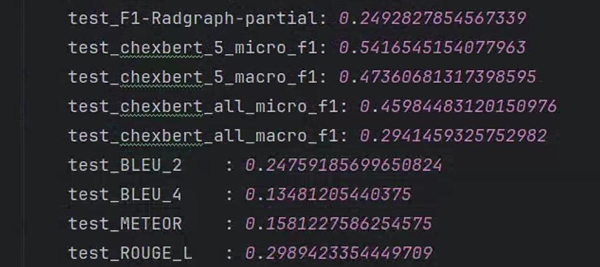

# SEI
Structural Entities Extraction and Patient Indications Incorporation for Chest X-ray Report Generation


## Citations

If you use or extend our work, please cite our paper at EMNLP-2020.

```

```

## Requirements

- `torch==2.1.2+cu118`
- `transformers==4.23.1`
- `torchvision==0.16.2+cu118`
- Due to the specific environment of RadGraph,  please refer to `knowledge_encoder/factual serialization. py` for the environment of the structural entities approach.


## Checkpoints

You can download checkpoints of FSE as follows:

- For `MIMIC-CXR`, you can download checkpoints from [here](https://pan.baidu.com/s/17-hlaUR6dPgwhXWhZyw2tQ), and its code is `MK13`.

- For `IU X-Ray`, you can download checkpoints from [here](https://pan.baidu.com/s/1SPSNGKEwSKlywUVDFxv_eg), and its code is `MK13`.

## Datasets

We use two datasets (IU X-Ray and MIMIC-CXR) in our paper.

- For `IU X-Ray`, you can download medical images from [here](https://drive.google.com/file/d/1c0BXEuDy8Cmm2jfN0YYGkQxFZd2ZIoLg/view?usp=sharing).

- For `MIMIC-CXR`, you can download medical images from [here](https://physionet.org/content/mimic-cxr/2.0.0/).

- You can download **medical reports** from [here](https://pan.baidu.com/s/1bMbee6XuyXhhLUZM8kfbEw), and its code is `MK13`.

NOTE: The `IU X-Ray` dataset is of small size, and thus the variance of the results is large.
There have been some works using `MIMIC-CXR` only and treating the whole `IU X-Ray` dataset as an extra test set.

## Reproducibility on MIMIC-CXR

### Extracting factual serialization using structural entities approach

1. Config RadGraph environment based on `knowledge_encoder/factual_serialization.py`
2. Set the local path in `config/finetune_config.yaml` for images and checkpoints, such as `mimic_cxr_image_dir` and `chexbert_model_checkpoint`
3. Run the `knowledge_encoder/factual_serialization.py` to extract factual serialization for each sample.

Notably,`chexbert.pth` can download from [here](https://stanfordmedicine.app.box.com/s/c3stck6w6dol3h36grdc97xoydzxd7w9). `distilbert-base-uncased` can download from [here](https://huggingface.co/distilbert/distilbert-base-uncased). `bert-base-uncased` can download from [here](https://huggingface.co/google-bert/bert-base-uncased). `radgraph` can download from [here](https://physionet.org/content/radgraph/1.0.0/). `scibert_scivocab_uncased` can download from [here](https://huggingface.co/allenai/scibert_scivocab_uncased). 

### Conducting the first stage (i.e., training cross-modal alignment module)

Run `bash pretrain_mimic_cxr.sh` to pretrain a model on the MIMIC-CXR data.

### Similar historical cases for each sample

1. Config `--load` argument in `pretrain_inference_mimic_cxr.sh`
2. Run `bash pretrain_inference_mimic_cxr.sh` to retrieve similar historical cases for each sample, forming `mimic_cxr_annotation_sen_best_reports_keywords_20.json`.

### Conducting the second stage (i.e., training report generation module)

1. Config `--load` argument in `finetune_mimic_cxr.sh`
2. Run `bash finetune_mimic_cxr.sh` to generate reports based on similar historical cases.

### Test 

1. You must download the medical images, their corresponding reports (i.e., `mimic_cxr_annotation_sen_best_reports_keywords_20.json`),  and checkpoints (i.e., `finetune_model_best.pth`) in Section Datasets and Section Checkpoints, respectively.

2. Config `--load` and `--mimic_cxr_ann_path`arguments in `test_mimic_cxr.sh`

3. Run `bash test_mimic_cxr.sh` to generate reports based on similar historical cases.

4. Results on MIMIC-CXR are presented as follows:

<div align=center></div>

## Reproducibility on IU X-ray

### Results on IU-Xray are presented as follows:

<div align=center></div>

## Acknowledgement

- [R2Gen](https://github.com/zhjohnchan/R2Gen) Some codes are adapted based on R2Gen.
- [R2GenCMN](https://github.com/zhjohnchan/R2GenCMN) Some codes are adapted based on R2GenCMN.
- [MGCA](https://github.com/HKU-MedAI/MGCA) Some codes are adapted based on R2GenCMN.

## References

[1] Chen, Z., Song, Y., Chang, T.H., Wan, X., 2020. Generating radiology reports via memory-driven transformer, in: EMNLP, pp. 1439–1449. 

[2] Chen, Z., Shen, Y., Song, Y., Wan, X., 2021. Cross-modal memory networks for radiology report generation, in: ACL, pp. 5904–5914. 

[3] Wang, F., Zhou, Y., Wang, S., Vardhanabhuti, V., Yu, L., 2022. Multigranularity cross-modal alignment for generalized medical visual representation learning, in: NeurIPS, pp. 33536–33549.
